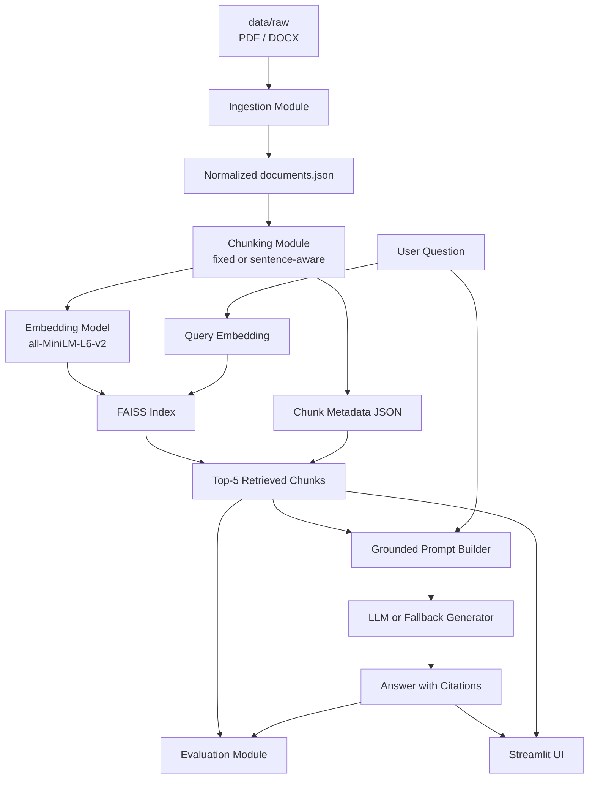

# RAG Chatbot Architecture

## Notes

- The ingestion step extracts text and metadata from PDF and DOCX files.
- Chunk metadata is preserved across chunking, indexing, retrieval, generation, and evaluation.
- The generator is configured to refuse unsupported questions with the exact required sentence.
